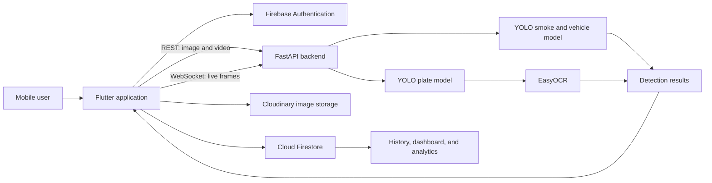

# SmokeVision

## AI-Powered Real-Time Vehicle Smoke Detection System

<p align="center">
  
</p>

<p align="center">
  A Flutter and YOLO-based system for detecting vehicle exhaust smoke from images,
  videos, and live camera streams.
</p>

<p align="center">
  
  
  
  
  
</p>

SmokeVision is a final-year project designed to make vehicle-emission monitoring
more accessible. The system combines a cross-platform Flutter application with a
FastAPI inference service, YOLO object-detection models, EasyOCR, Firebase, and
location-aware detection records.

The application can analyze uploaded media or stream camera frames to the backend,
identify vehicle smoke and number plates, display bounding boxes, and save detection
history for later filtering and analysis.

> This is an academic and research prototype. Smoke color can indicate a possible
> mechanical problem, but it is not a substitute for certified emissions testing or
> professional vehicle diagnosis.

## Repositories

| Component | Repository | Purpose |
| --- | --- | --- |
| Mobile application | [AI-Powered-Real-Time-Smoke-Detection-System](https://github.com/UniversityFYP/AI-Powered-Real-Time-Smoke-Detection-System) | Flutter UI, Firebase authentication, history, analytics, uploads, and live detection |
| Inference backend | [AI-Powered-Real-Time-Smoke-Detection-System-Backend](https://github.com/UniversityFYP/AI-Powered-Real-Time-Smoke-Detection-System-Backend) | FastAPI endpoints, WebSocket inference, YOLO models, EasyOCR, and training artifacts |

## Features

- Email/password sign-up, sign-in, password recovery, and profile management
- Smoke detection from uploaded images
- Frame-by-frame smoke detection from uploaded videos
- Live camera detection over a WebSocket connection
- Bounding boxes, confidence scores, and smoke-class labels
- Vehicle and number-plate detection with EasyOCR text extraction
- Detection history with image, date, time, smoke type, plate number, and location
- History filtering by date and smoke type
- Dashboard statistics and graphical trend analysis
- Smoke-color diagnosis and vehicle-maintenance guidance
- Interactive FastAPI documentation at `/docs`

## Smoke Classes

| Smoke type | Possible indication |
| --- | --- |
| Black smoke | Excess fuel, incomplete combustion, or an air/fuel-system problem |
| White smoke | Condensation or a possible coolant leak |
| Blue smoke | Possible engine-oil combustion |
| Gray smoke | Possible oil, turbocharger, transmission-fluid, or combustion issue |

These indications are educational only. A mechanic or authorized emissions-testing
facility should confirm any diagnosis.

## System Architecture



The active Flutter implementation sends media to the FastAPI backend. A
`SmokeVision.tflite` asset is included in the frontend repository, but on-device
TFLite inference is not currently connected to the application's detection flow.

## Technology Stack

### Frontend

- Flutter and Dart
- Firebase Authentication
- Cloud Firestore
- Camera, image picker, video player, and WebSocket packages
- Geolocator and geocoding
- FL Chart
- Cloudinary client

### Backend and AI

- Python
- FastAPI and Uvicorn
- Ultralytics YOLO
- PyTorch
- OpenCV, Pillow, and NumPy
- EasyOCR
- CustomTkinter for the optional desktop server interface

## Project Structure

```text
Frontend
├── assets/
│   ├── Icons/
│   ├── images/
│   └── SmokeVision.tflite
├── lib/
│   ├── main.dart
│   ├── MainAppWrapper.dart
│   └── screens/
│       ├── controller/
│       ├── main_screens/
│       └── nav_bar/
├── android/
├── ios/
├── test/
└── pubspec.yaml

Backend
├── Application_Backend/
│   ├── Server_CLI.py
│   ├── Server_GUI.py
│   ├── Server_Logo.py
│   └── requirements.txt
├── Smoke_YOLOv11n_68%/
│   ├── weights/
│   ├── results.csv
│   └── training graphs
└── YOLO_Train.py
```

## Prerequisites

- Flutter SDK with Dart `3.7.2` compatibility
- Android Studio or Xcode for mobile development
- Python 3.10 or 3.11
- A Firebase project with Email/Password Authentication and Cloud Firestore enabled
- A Cloudinary account if detection images will be saved
- Smoke-detection and number-plate YOLO weights
- A phone/emulator and backend computer on the same network for local testing

## Quick Start

### 1. Clone the repositories

```bash
git clone https://github.com/UniversityFYP/AI-Powered-Real-Time-Smoke-Detection-System.git
git clone https://github.com/UniversityFYP/AI-Powered-Real-Time-Smoke-Detection-System-Backend.git
```

### 2. Configure and run the backend

```bash
cd AI-Powered-Real-Time-Smoke-Detection-System-Backend/Application_Backend

python -m venv .venv

# Windows
.venv\Scripts\activate

# macOS/Linux
# source .venv/bin/activate
```

The checked-in backend requirements currently contain duplicate exact versions of
OpenCV, PyTorch, and Ultralytics. Normalize those pins before using
`pip install -r requirements.txt`. For a temporary development environment, install
the runtime packages directly:

```bash
pip install fastapi "uvicorn[standard]" python-multipart pillow numpy \
  opencv-python ultralytics easyocr torch customtkinter
```

Open `Application_Backend/Server_CLI.py` and replace the two local `H:\...` model
paths with valid paths on your machine:

```python
model = YOLO("path/to/smoke_model.pt").to("cpu")
plate_model = YOLO("path/to/number_plate_model.pt").to("cpu")
```

Then start the API:

```bash
uvicorn Server_CLI:app --reload --host 0.0.0.0 --port 8000
```

Verify the service at:

- API root: `http://localhost:8000`
- Swagger UI: `http://localhost:8000/docs`

### 3. Configure Firebase

1. Create or select a Firebase project.
2. Enable **Email/Password** under Firebase Authentication.
3. Create a Cloud Firestore database.
4. Register the Android and/or iOS application.
5. Replace the platform configuration with your own:
   - Android: `android/app/google-services.json`
   - iOS: `ios/Runner/GoogleService-Info.plist`
6. Apply Firestore security rules that restrict each user's data appropriately.

The application uses these collections:

| Collection | Purpose |
| --- | --- |
| `users` | User profile information |
| `detections` | Smoke type, image URL, plate number, timestamp, and location |

### 4. Configure image storage

The current Cloudinary fields in
`lib/screens/main_screens/Upload.dart` are intentionally blank.

Do not commit a Cloudinary API secret to the Flutter application. For production,
generate signed uploads through a trusted backend or use a restricted unsigned upload
preset. Detection analysis works without history-image uploads, but saving a complete
detection record requires a valid image URL.

### 5. Configure mobile permissions

The application needs:

- Camera access
- Internet access
- Fine/coarse location access
- Photo/video-library access where required by the platform

Add the appropriate Android manifest and iOS `Info.plist` permission descriptions
before testing on a physical device.

### 6. Run the Flutter application

```bash
cd AI-Powered-Real-Time-Smoke-Detection-System
flutter pub get
flutter run
```

On the sign-in screen, enter:

- **IP address:** the backend computer's LAN address, for example `192.168.1.10`
- **Port:** `8000`

Do not enter `localhost` when the app is running on a physical phone; `localhost`
would refer to the phone itself.

## API Reference

| Method | Endpoint | Description |
| --- | --- | --- |
| `POST` | `/predict-image` | Analyze an uploaded image and return object, smoke, and plate detections |
| `POST` | `/predict-video` | Analyze an uploaded video and return detections grouped by frame |
| `WebSocket` | `/ws-video-stream` | Receive encoded live-camera frames and return real-time detections |
| `GET` | `/docs` | Open the generated Swagger API documentation |

### Example image request

```bash
curl -X POST "http://localhost:8000/predict-image" \
  -H "accept: application/json" \
  -H "Content-Type: multipart/form-data" \
  -F "file=@vehicle-smoke.jpg"
```

### Detection response shape

```json
{
  "predictions": [
    {
      "class_Id": 0,
      "class_name": "BlackSmoke",
      "confidence": 0.91,
      "bbox": [120.4, 84.2, 420.8, 355.6],
      "model_type": "object_detection"
    },
    {
      "class_Id": 0,
      "class_name": "LicensePlate",
      "confidence": 0.88,
      "bbox": [240.0, 300.0, 330.0, 345.0],
      "plate_text": "ABC123",
      "model_type": "plate_detection"
    }
  ]
}
```

## Recorded Model Results

The backend repository includes a recorded YOLO11n training run of 70 epochs.
The final epoch reports:

| Metric | Value |
| --- | ---: |
| Precision | 65.5% |
| Recall | 69.4% |
| mAP50 | 67.4% |
| mAP50-95 | 48.9% |

These values describe the checked-in experimental run, not a production guarantee.
Results will vary with the dataset, class balance, lighting, weather, camera position,
and confidence threshold.

## Testing

The academic report documents manual black-box and white-box scenarios for:

- Sign-up and sign-in
- Image and video uploads
- Live-camera detection
- Detection history
- Statistics filters
- Profile management
- Logout

Run the available Flutter checks with:

```bash
flutter analyze
flutter test
```

The repository currently contains Flutter's template counter test and no automated
backend test suite. Replace the template with feature-specific tests before treating
the application as release-ready.

## Privacy and Security

Detection records can contain faces, vehicles, number plates, timestamps, and precise
locations. Before deployment:

- Obtain consent and follow applicable privacy and surveillance laws.
- Do not commit detection images, credentials, API secrets, or private model data.
- Use authenticated HTTPS and secure WebSockets instead of public HTTP/WS endpoints.
- Restrict CORS to trusted application origins.
- Enforce upload size and media-type limits.
- Protect Firestore with authenticated, least-privilege security rules.
- Define a retention and deletion policy for images and detection records.

The current FastAPI service is intended for trusted local development and should be
hardened before it is exposed to the internet.

## Known Limitations

- Outdoor accuracy can fall because of fog, dust, shadows, lighting, distance, and
  occlusion.
- The mobile application currently depends on a reachable backend for inference.
- The included TFLite model is not connected to active on-device inference.
- Backend model paths must currently be configured in source code.
- Cloudinary history-image uploads require secure external configuration.
- Long videos can be expensive to process and may take significant time or memory.

## Roadmap

- Expand and rebalance the dataset across vehicle types and environmental conditions
- Improve model accuracy and reduce false positives
- Complete optimized on-device TFLite inference
- Add automated frontend, API, and model-regression tests
- Add secure cloud deployment and centralized reporting
- Add IoT air-quality sensor fusion
- Improve reporting for fleet and environmental-monitoring use cases
- Evaluate authorized smart-city or regulatory integrations

## Contributing

1. Fork the relevant repository.
2. Create a branch: `git checkout -b feature/your-feature`.
3. Make a focused change and add tests.
4. Run the relevant checks.
5. Commit with a clear message.
6. Open a pull request describing the change and how it was verified.

## Academic Context

SmokeVision was developed as a university final-year project focused on affordable,
scalable vehicle-emission awareness. It supports the broader goals of public health,
sustainable cities, climate action, and responsible technology use.

The full project report, `Doc_Raza.pdf`, contains the requirements specification,
use cases, architecture and data-flow diagrams, UI designs, manual test cases,
conclusions, and future work.

## License

No open-source license is currently included. Add a license before allowing reuse,
redistribution, or derivative work.
